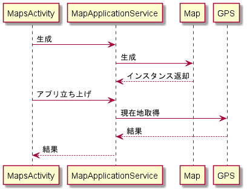
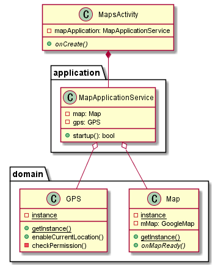

# MAP 表示 v0.1

## インターフェース

### MapApplicationService().startUp()

#### 処理概要

- アプリの起動時に実行される。ユーザーに GPS 使用許可を得て、現在地を取得する
- 例外発生時（GPS 使用の拒否）は、アクティビティの実行を不可にする。bool で管理する
- マップの準備ができたらユーザーに GPS の使用の可否を問い合わせる
- 使用許可が降りたら、現在地の表示を行う

#### 出力

- true: 現在地取得成功
- false or 例外: 現在地の取得失敗

## シーケンス図

## クラス図

