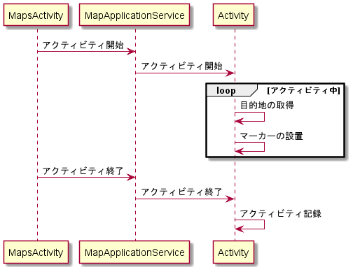
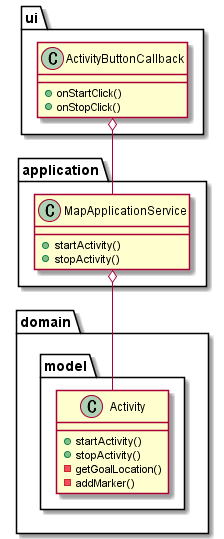

# チェックポイント取得設計書 v0.1

- アクティビティの開始時に実行される
- コンビニや公園などにチェックポイントが立つ
- チェックポイントに到達したら新しいチェックポイントが立つ

## 処理の流れ

1. Activity クラスの startActivity()メソッドを呼び出す
1. Google Place API を使用して、getGoalLocation()メソッドを呼び出して、目的地となるチェックポイントの場所を取得する
1. チェックポイントの場所に addMarker()メソッドでマーカーを立てる
1. 現在地とチェックポイントの場所が一致したら、もう一度 startActivity()メソッドを呼び出す
1. 終了ボタンが押されたらループを抜け出す
<!-- 1. アクティビティを記録する -->

## 処理詳細

### MapApplicationService.startActivity()

- トリガー: アクティビティ開始ボタンのクリック
- フロー
  1. Activity.startActivity()を呼び出す
- 出力: なし or GPS を許可していない時はパーミッションの許可を求め、遷移

### Activity.startActivity()

- フロー
  1. フラグが true の間ループする
  1. 目的地の取得メソッド呼び出し
  1. マーカー追加メソッド呼び出し
  1. ループ終了
  <!-- 1. アクティビティの記録 -->
- 出力: チェックポイントにマーカーを立てる

### MapApplicationService.stopActivity()

### Activity.stopActivity()

- フロー
  1. フラグを true にする

### Activity.getGoalLocation()

- フロー
  1. Google Place API を使用して目的地となるチェックポイントの場所を取得する

### Activity.addMarker()

- フロー
  1. マップにマーカーを立てる

## シーケンス図

## クラス図

