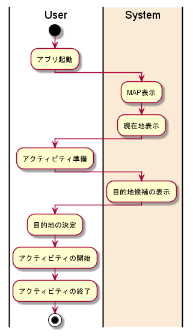

# 要件定義書 v1.0

プロジェクト全体の要件定義書

## システム化の目的

[./企画書.pdf](企画書.pdf)

## システム化範囲

1. ユーザーが散歩することを決意する
1. アプリを立ち上げる <システムの開始>
1. 散歩の設定を行う
1. 目的地の表示を行う
1. アクティビティの開始
1. ユーザーがアクティビティの実行
1. アクティビティの終了
1. アクティビティの記録 <システムの終了>

 

## システムフロー

### システム一覧

#### 会員管理: F01

##### 入会

- 会員登録

##### 変更

- 会員情報変更
- 会員退会

#### MAP サービス: F02

##### 利用開始

- 開始手続き

##### 利用終了

- 終了手続き

### アクティビティ図

 

## データ

### users

会員情報

- id
- user_name {string} 重複なし
- email {string} 重複なし
- password {string}
- sex
- age

### activities

アクティビティ情報

- id
- user_id {int}
- distance {int}
- start {DATETIME}
- end {DATETIME}

 

## システムルール

### ユーザ名: R001

- 重複なし
- 5 文字以上 10 文字以下
- 英数字のみ
- 英語と数字を必ず含む

### メールアドレス: R002

- 重複なし

### パスワード: R003

- ユーザ名と異なる
- 8 文字以上
- 英数字のみ
- 英語と数字を必ず含む
- 3 文字以上同じ文字を続けるのは不可

 

## 入出力情報

### 会員情報

- 入力
- ユーザーの会員登録情報
- 15 人

### アクティビティ情報

- 入力
- ユーザーが行ったアクティビティ登録情報
- ユーザー数\*10

 

## システム機能

### 会員管理: F01

#### 会員登録

#### 会員情報照合

- ログイン
- ログアウト

#### 会員情報変更

#### 会員退会

### MAP サービス: F02

#### MAP 表示

#### 目的地表示

- チェックポイント
- ルート
- おおよその歩数
- 過去ルートの把握
- 目的別ルート設定

#### 密集地表示

#### ランキング

- 記録
- 表示
- トロフィー・バッジ

#### アクティビティ記録

- 万歩計
- 消費カロリー計算

#### ランドマーク

- 追加
- 表示
- 評価

#### 天候予測

 

## 画面一覧

### メイン画面: S001

- MAP サービス
- ユーザーが主に利用する画面
- ルート表示など

### 会員登録画面: S002

- 会員管理
- 登録する会員情報の入力画面
- 会員登録

### ログイン画面: S003

- 会員管理
- 登録した会員情報の入力画面
- 会員情報照合

### 会員情報変更画面: S004

- 会員管理
- 変更したい会員情報の入力画面
- 会員情報変更

### 会員退会画面: S005

- 会員管理
- 会員退会の確認画面
- 会員退会

 

## 非機能要件

### 技術・環境要件

- プラットフォーム: Android
- 採用する技術: Google Maps API
- 開発言語: Kotlin
- RDBMS: firebase firestore

### パフォーマンス

- 総ユーザー数の約半分

### スケーラビリティ

- Google Cloud Platform の無料枠内
- firebase firestore の無料枠内

### セキュリティ

- アクセス制限: DB 管理者の制限
- 不正監視: ログの取得
- データの暗号化: パスワードのハッシュ化

### 運用性

- Google Cloud Platform によるリクエスト管理
- firebase によるリクエスト管理

### ユーザビリティ

- メインターゲットは運動不足の中年男性
- 誰でも使いやすいようなデザイン

 
